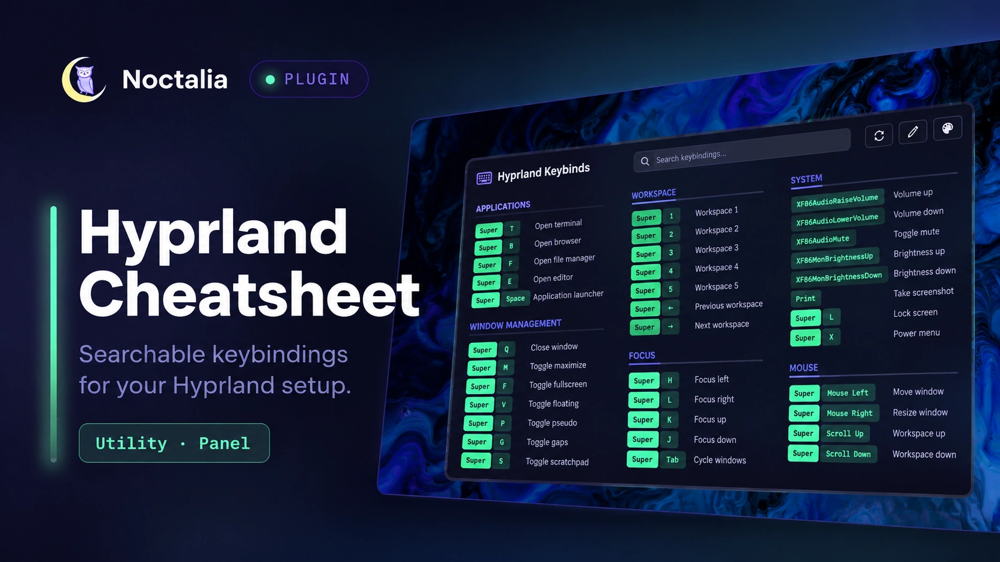

# Hyprland Cheatsheet

Hyprland Cheatsheet opens a searchable Noctalia panel containing the active
Hyprland keybindings.

It supports both classic Hyprland configuration and Hyprland Lua
configuration, formats common hardware keys, groups bindings by their
descriptions, and keeps custom descriptions, hidden rows, and color overrides.



## Plugin

| Field | Value |
| --- | --- |
| ID | `syaikhu/hypr-cheatsheet` |
| Entries | Data service: `data`; bar widget: `keybinds`; panel: `cheatsheet` |

`syaikhu` is the plugin's fixed publisher namespace, not your local Linux
username. Copy the plugin IDs in the commands below unchanged. User-specific
configuration paths use the portable `~/.config/...` form.

## Requirements

Hyprland must be running.

Install `hyprctl` on `PATH` when using a Hyprland Lua configuration. Lua mode
uses `hyprctl binds -j` to obtain the active Hyprland keybindings.

No clipboard command is required. Color paste uses Noctalia's native
clipboard API.

## Usage

Enable the plugin and add the `keybinds` widget from Noctalia's bar widget
picker. Clicking its keyboard glyph toggles the cheatsheet.

Open or close the panel without a bar widget:

```sh
noctalia msg panel-toggle syaikhu/hypr-cheatsheet:cheatsheet
```

You can bind that command to any Hyprland keybind. For example:

```ini
bind = SUPER, F1, exec, noctalia msg panel-toggle syaikhu/hypr-cheatsheet:cheatsheet
```

Type in the search field to filter by key, description, action, or category.

Use the header pencil to enter edit mode. Edit mode keeps hidden bindings
visible with muted content while descriptions and visibility are changed with
the row's pencil and eye buttons.

The palette button opens key-color controls with native color picking,
clipboard paste, and reset actions.

## Supported configuration

| Configuration | Default | Parsing |
| --- | --- | --- |
| Hyprland classic | `~/.config/hypr/hyprland.conf` | `bind*` directives, variables, and recursive `source` paths |
| Hyprland Lua | `~/.config/hypr/hyprland.lua` | Live `hyprctl binds -j` data |

Set the configuration explicitly with the plugin settings:

```lua
config = "~/.config/hypr/hyprland.lua"
config_type = "lua"
```

or:

```lua
config = "~/.config/hypr/hyprland.conf"
config_type = "hyprlang"
```

For classic Hyprland configuration, `source` paths are resolved recursively.
Traversal is limited to 32 levels and 256 files, and repeated paths are visited
once to prevent cycles.

## Binding groups

Bindings can define their display group directly in their description.

Use:

```text
[Applications] open terminal
```

The panel displays:

```text
APPLICATIONS

Super + T    open terminal
```

The `[Applications]` part is metadata used as the group name and is not shown
as part of the description.

A binding without a group:

```text
open terminal
```

is placed in the `Other` group.

This also means that the following are equivalent from the panel's point of
view:

```text
[Applications] open terminal
[Window Management] close window
[Workspace] switch workspace
```

The service parses the group and clean description before publishing the
snapshot consumed by the panel.

## Settings

| Setting | Type | Default | Description |
| --- | --- | --- | --- |
| `config` | `file` | `~/.config/hypr/hyprland.lua` | Hyprland configuration file to use. |
| `config_type` | `select` | `lua` | Configuration parser: `lua` or `hyprlang`. |
| `columns` | `int` | `3` | Maximum balanced columns, from 1 to 4. |
| `show_undescribed` | `bool` | `false` | Show bindings that have no description. |
| `glyph` | `glyph` | `keyboard` | Bar widget icon. |

Example:

```lua
programs.noctalia.settings = {
  plugins.enabled = {
    "syaikhu/hypr-cheatsheet"
  };

  plugin_settings."syaikhu/hypr-cheatsheet" = {
    config = "~/.config/hypr/hyprland.lua";
    config_type = "lua";

    columns = 3;

    show_undescribed = false;
  };
};
```

## IPC

Refresh the binding snapshot after editing the Hyprland configuration:

```sh
noctalia msg plugin syaikhu/hypr-cheatsheet:data all refresh
```

The data service refreshes independently of whether the panel is open.

The bar widget also accepts `toggle` and `refresh`:

```sh
noctalia msg plugin syaikhu/hypr-cheatsheet:keybinds focused toggle
noctalia msg plugin syaikhu/hypr-cheatsheet:keybinds focused refresh
```

For parser development, run the service self-test:

```sh
noctalia msg plugin syaikhu/hypr-cheatsheet:data all self-test
```

The report is logged and written to the plugin's persistent data directory as
`selftest.json`.

## Architecture

The plugin is split into three event-driven components:

```text
Hyprland configuration
        │
        ▼
    data service
        │
        ├── parse configuration
        ├── normalize bindings
        ├── assign groups
        └── maintain durable cache
        │
        ▼
  shared snapshot
        │
        ├───────────────┐
        ▼               ▼
   panel.luau       widget.luau
        │               │
        ▼               ▼
     render          toggle /
                    refresh
```

The data service owns parsing, cache state, and refreshes. The panel only reads
the shared snapshot and handles presentation, search, editing, visibility, and
colors.

The widget is intentionally lightweight and only toggles the panel or requests
a refresh.

There are no timers, polling loops, filesystem watchers, network requests, or
persistent helper processes.

## Cache and persistence

The last successful parsed snapshot is stored as `bindings-cache.json`.

The panel reads the shared in-memory snapshot and does not parse the Hyprland
configuration itself.

A failed refresh keeps the previous successful bindings visible and reports
the refresh error without replacing the durable cache.

Custom descriptions, hidden binding identities, and color overrides are stored
in Noctalia's per-plugin state directory as `preferences.json`.

The preferences file contains no command output or Hyprland configuration
contents.

## Performance

The plugin uses event-driven work distribution to stay within Noctalia's Luau
CPU budget.

Large binding lists are rendered progressively by the panel instead of building
the complete UI tree in a single callback.

Refresh work is also split into event-driven steps where necessary.

Nothing runs while the plugin is idle.

## Acknowledgements

Hyprland Cheatsheet was inspired by the original
[Keybind Cheatsheet for Noctalia v4](https://github.com/4rmcyt/noctalia-plugins/tree/main/keybind-cheatsheet)
created by [blackbartblues](https://github.com/blackbartblues).

This Noctalia v5 plugin is an independent implementation rather than a direct
port. It has its own user interface, Hyprland-specific service and cache
lifecycle, persistence model, and integration with the current Noctalia plugin
API.
